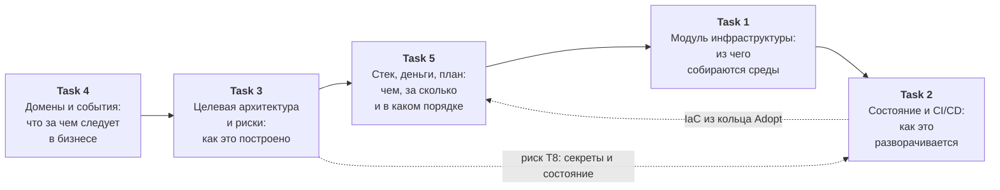

# «Будущее 2.0» — архитектура работы с данными и инфраструктура

Проектная работа: трансформация ИТ-ландшафта медицинско-финтех-экосистемы —
от централизованного DWH на SQL Server 2008 к слабосвязанной событийной платформе
с доменным владением данными и порталом самообслуживания.

## Структура репозитория

| Задание | Директория | Содержание |
|---|---|---|
| **1** | [Task1Advanced](Task1Advanced/README.md) | переиспользуемый Terraform-модуль `vm` и три окружения (dev / stage / prod) с раздельными `.tfvars` |
| **2** | [Task2Advanced](Task2Advanced/README.md) | удалённое состояние в S3-совместимом хранилище + CI/CD (GitLab CI и GitHub Actions) с ручным подтверждением apply |
| **3** | [Task3Advanced](Task3Advanced/README.md) | целевая архитектура в модели C4 (контекст, контейнеры, компоненты), карта рисков и план управления ими |
| **4** | [Task4Advanced](Task4Advanced/README.md) | bounded contexts, Event Storming, агрегаты, каталог доменных событий, обоснование событийного подхода |
| **5** | [Task5Advanced](Task5Advanced/README.md) | расширенный техрадар, TCO-анализ на 3 года, стратегический роадмап Data Mesh |

Дополнительно в корне:

| Файл | Назначение |
|---|---|
| [.gitlab-ci.yml](.gitlab-ci.yml) | корневой конвейер GitLab, подключает компонент из `Task2Advanced/ci/` |
| [.github/workflows/terraform.yml](.github/workflows/terraform.yml) | конвейер GitHub Actions: validate → security → plan → apply по окружениям |
| [.github/workflows/terraform-apply.yml](.github/workflows/terraform-apply.yml) | переиспользуемый workflow применения плана с подтверждением через Environments |

## Сквозная логика решения

Пять заданий — не пять независимых артефактов, а один связный проект:



* **Границы доменов и события** (Task 4) определяют, из каких контейнеров состоит
  система (Task 3).
* **Карта рисков** (Task 3) задаёт требования к инфраструктуре: изоляция окружений,
  защита состояния Terraform, отсутствие секретов в репозитории — всё это реализовано
  в Task 1 и Task 2.
* **Техрадар и TCO** (Task 5) обосновывают выбор технологий и порядок работ, а роадмап
  привязывает этапы к целям бизнеса из постановки задачи.

## Ключевые решения

1. **Портал самообслуживания без доменной логики.** Витрина умеет показать каталог
   опубликованных дата-продуктов и построить по ним отчёт в пределах прав пользователя.
   Подключение нового бизнес-направления — регистрация продуктов в каталоге,
   а не доработка портала. Это и есть масштабируемость, независимая от числа доменов.

2. **Медицинские данные не попадают в аналитику технически, а не по регламенту.**
   Домен-издатель формирует две проекции событий: внутреннюю (с клиническим содержанием)
   и внешнюю (операционные атрибуты). Продукты класса PHI не имеют физического маршрута
   в lakehouse; схемы проверяются сканером в CI.

3. **Бизнес-логика возвращается из DWH в домены.** Интеграция новых направлений
   не требует изменений в хранилище: домен публикует события и дата-продукты.

4. **Легаси выводится по паттерну strangler fig.** Camel и DWH остаются мостами
   совместимости с назначенными владельцами и датами вывода. Каждый шаг закрывается
   тестом на паритет отчётности.

5. **Инфраструктура только как код.** Один модуль на все среды, состояние — в
   защищённом удалённом хранилище, применение — через конвейер с подтверждением.

## Как проверить инфраструктурную часть

```bash
cd Task1Advanced/envs/dev
terraform init
terraform plan -var-file=dev.tfvars
```

Конфигурации `Task1Advanced` и `Task2Advanced` проверены `fmt` и `validate`
(OpenTofu 1.12, провайдер `yandex-cloud/yandex` 0.127). В `.tfvars` подставлены
плейсхолдеры `cloud_id` / `folder_id` — перед реальным запуском их нужно заменить
своими идентификаторами.

## Допущения

* **Облако** — Yandex Cloud: в постановке задания в качестве примера S3-совместимого
  хранилища указан Yandex Object Storage, и это же соответствует требованиям к
  локализации медицинских и банковских данных.
* **CI/CD** — задание допускает любой инструмент; реализованы оба варианта
  (GitLab CI как основной, GitHub Actions как альтернатива под текущий remote репозитория).
* Суммы в TCO-анализе — модельные оценки в ценах 2026 года с открытым перечнем
  допущений и анализом чувствительности.
