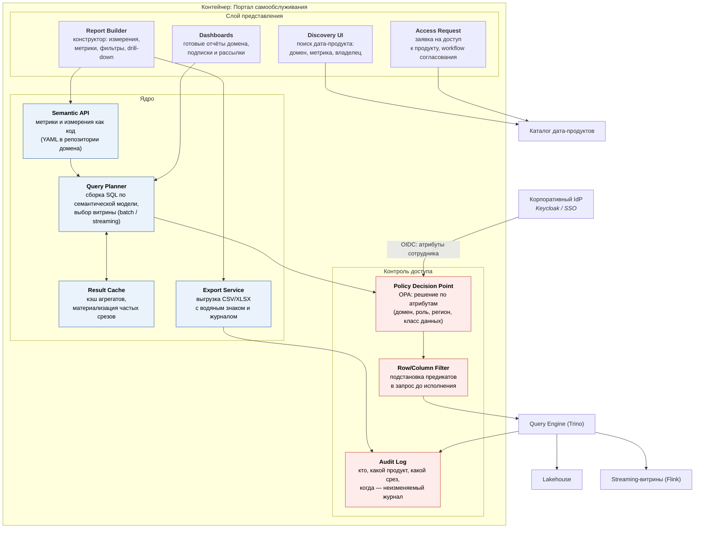
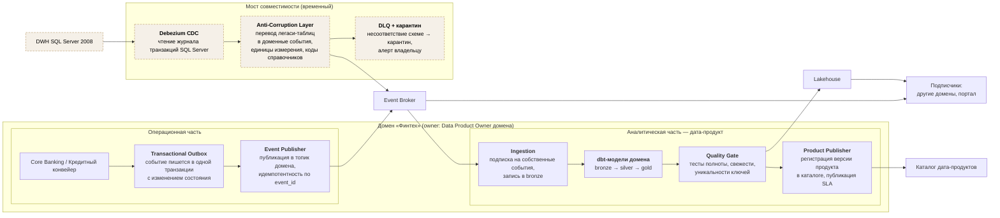
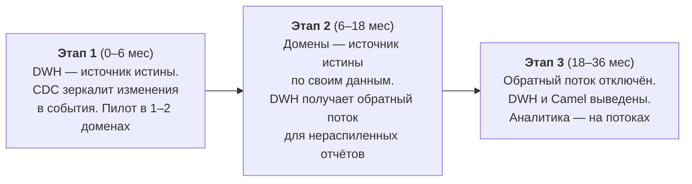

# C4. Уровень 3 — Компоненты

Детализированы два узла, определяющих успех трансформации: **портал самообслуживания**
(цель № 1 бизнеса) и **доменный дата-продукт вместе с мостом к легаси** (цель № 2).

---

## 3.1. Портал самообслуживания («витрина данных»)

### Как работает запрос аналитика

1. Сотрудник ищет дата-продукт в **Discovery UI**; каталог возвращает только те продукты,
   которые ему разрешено видеть (сам факт существования продуктов чужого домена может
   быть скрыт).
2. В **Report Builder** он выбирает метрики и измерения из семантической модели, а не
   таблицы. «Средний чек приёма» — это одна метрика с одним определением, а не пять
   разных SQL-выражений у пяти аналитиков.
3. **Query Planner** собирает запрос и выбирает источник: batch-витрина для исторических
   срезов, streaming-витрина — для оперативных.
4. **Policy Decision Point** принимает решение по атрибутам сотрудника. **Row/Column
   Filter** дописывает предикаты в запрос *до* исполнения — пользователь физически не
   может выбрать данные вне своего доступа, даже если подставит параметры вручную.
5. Результат кэшируется; выгрузки журналируются в **Audit Log**.

### Почему портал масштабируется без переделки

| Событие | Что делает домен | Что меняется в портале |
|---|---|---|
| Появилось новое бизнес-направление (аптеки) | публикует дата-продукты и семантическую модель | ничего: продукты появляются в каталоге |
| Домену нужна новая метрика | добавляет определение в свой YAML, проходит ревью | ничего |
| Выход в новый регион | добавляет атрибут `region` в политики и данные | ничего: RLS работает по атрибутам |
| Нужен near-real-time срез | публикует streaming-версию продукта | ничего: Query Planner выбирает источник по SLA продукта |

---

## 3.2. Доменный дата-продукт и мост к легаси

Схема ниже разбирает домен «Финтех» как пример; остальные домены устроены так же.

### Компоненты и их роль

| Компонент | Зачем нужен |
|---|---|
| **Transactional Outbox** | гарантирует, что событие не потеряется и не будет опубликовано без фиксации изменения — без распределённых транзакций |
| **Event Publisher** | идемпотентная публикация; повтор доставки не создаёт дубль эффекта у подписчика |
| **Ingestion → dbt → Quality Gate** | дата-продукт собирает и проверяет **сам домен**: качество — ответственность владельца, а не центральной команды DWH |
| **Product Publisher** | публикует версию продукта и SLA в каталог: потребитель видит, насколько свежи данные и кому писать при проблеме |
| **Anti-Corruption Layer** | не даёт легаси-модели SQL Server протечь в доменные события; всё уродство трансляции локализовано в одном месте и умирает вместе с DWH |
| **DLQ + карантин** | сообщение, не прошедшее валидацию схемы, не теряется и не ломает поток — оно уходит в карантин с алертом владельцу |

### Порядок вывода легаси

Ключевая проверка перехода между этапами — **тест на паритет**: отчёт, построенный
в новой витрине, сходится с отчётом из DWH на согласованном горизонте. Пока паритет
не подтверждён, старый контур не отключается.
