# C4. Уровень 2 — Контейнеры (целевое состояние, 3 года)

## Общая схема

```mermaid
flowchart TB
    subgraph Users["Пользователи"]
        U1["Аналитик / руководитель"]
        U2["Врач, оператор"]
        U3["Пациент, клиент банка"]
    end

    %% ------------- ДОМЕНЫ -------------
    subgraph Domains["Доменные системы (owner = домен)"]
        direction LR

        subgraph DomMed["Домен «Клиники»"]
            MEDAPI["Patient & Scheduling API<br/><i>Java / Kotlin</i>"]
            EHR["EHR Service (ЭМК)<br/><i>Java, PostgreSQL</i><br/>⚠ хранит PHI"]
            OPSUI["Clinic Web UI<br/><i>React</i><br/>(замена PowerBuilder)"]
        end

        subgraph DomAI["Домен «ИИ-сервисы»"]
            INF["Inference API<br/><i>Python, FastAPI</i>"]
            MLOPS["Model Registry + Feature Store<br/><i>MLflow, Feast</i>"]
        end

        subgraph DomFin["Домен «Финтех»"]
            CORE["Core Banking<br/><i>Go / Java</i>"]
            LOAN["Кредитный конвейер<br/><i>Java</i>"]
            PAYS["Платежи и эквайринг<br/><i>Go</i>"]
        end

        subgraph DomBack["Поддерживающие домены"]
            BILL["Биллинг медуслуг"]
            HR["HR и персонал"]
            INV["Инвентаризация и оборудование"]
            FINC["Корпоративные финансы"]
        end
    end

    %% ------------- ПЛАТФОРМА СОБЫТИЙ -------------
    subgraph Backbone["Событийная магистраль"]
        direction LR
        KAFKA["<b>Event Broker</b><br/><i>Apache Kafka</i><br/>топики по доменам, DLQ, retention"]
        SR["<b>Schema Registry</b><br/>Avro/Protobuf,<br/>контроль совместимости"]
        CDC["<b>CDC</b><br/><i>Debezium</i><br/>захват изменений из БД доменов и DWH"]
        FLINK["<b>Stream Processing</b><br/><i>Apache Flink</i><br/>обогащение, агрегация,<br/>near-real-time витрины"]
    end

    %% ------------- DATA PLATFORM -------------
    subgraph Platform["Data-платформа (self-serve, Data Mesh)"]
        direction TB
        LAKE["<b>Lakehouse</b><br/>Object Storage + Apache Iceberg<br/>bronze / silver / gold"]
        DBT["<b>Transformation</b><br/><i>dbt</i> + оркестратор <i>Airflow</i>"]
        QUERY["<b>Query Engine</b><br/><i>Trino</i> — федеративные запросы<br/>к lakehouse и источникам"]
        CAT["<b>Каталог дата-продуктов</b><br/><i>DataHub / OpenMetadata</i><br/>владельцы, SLA, происхождение"]
        CONTRACT["<b>Реестр контрактов данных</b><br/>схема + семантика + SLA +<br/>класс конфиденциальности"]
        GOV["<b>Policy Enforcement</b><br/>ABAC/RLS/маскирование,<br/><i>OPA + Ranger</i>"]
        QUAL["<b>Data Quality</b><br/>тесты качества,<br/>алерты владельцу продукта"]
    end

    %% ------------- ВИТРИНА -------------
    subgraph Portal["Портал самообслуживания («витрина данных»)"]
        direction LR
        SEM["<b>Семантический слой</b><br/>метрики, измерения,<br/>единые определения"]
        BI["<b>BI / конструктор отчётов</b><br/>готовые дашборды +<br/>ad-hoc отчёты"]
        MART["<b>Каталог витрин</b><br/>поиск по дата-продуктам,<br/>запрос доступа"]
    end

    %% ------------- LEGACY -------------
    subgraph LegacyBox["Легаси и мосты совместимости"]
        direction LR
        DWH["<b>DWH SQL Server 2008</b><br/>сокращается до источника,<br/>затем выводится"]
        CAMEL["<b>ESB Apache Camel</b><br/>только как мост"]
        ACL["<b>Anti-Corruption Layer</b><br/>трансляция легаси-моделей<br/>в доменные события"]
    end

    %% ------------- СВЯЗИ -------------
    U2 --> OPSUI --> MEDAPI
    U2 --> EHR
    U3 --> MEDAPI
    U3 --> CORE
    U1 --> BI
    U1 --> MART

    MEDAPI -- "события домена" --> KAFKA
    EHR -- "события БЕЗ PHI" --> KAFKA
    INF -- "события результата" --> KAFKA
    CORE --> KAFKA
    LOAN --> KAFKA
    PAYS --> KAFKA
    BILL --> KAFKA
    HR --> KAFKA
    INV --> KAFKA
    FINC --> KAFKA

    MEDAPI <-->|"sync, критичный путь"| INF
    INF -- "запрос данных пациента" --> EHR

    KAFKA <--> SR
    KAFKA --> FLINK
    CDC --> KAFKA
    DWH --> CDC
    CAMEL --> ACL --> KAFKA

    FLINK --> LAKE
    KAFKA --> LAKE
    LAKE <--> DBT
    DBT --> LAKE
    LAKE --> QUERY
    QUERY --> SEM --> BI
    CAT <--> LAKE
    CONTRACT --> SR
    CONTRACT --> CAT
    GOV --> QUERY
    GOV --> BI
    QUAL --> LAKE
    CAT --> MART

    classDef legacy fill:#f5f0e8,stroke:#b08d57,stroke-dasharray: 5 3,color:#000
    classDef phi fill:#fdecea,stroke:#c0392b,color:#000
    classDef bb fill:#eaf3fb,stroke:#2c5aa0,color:#000
    classDef plat fill:#eef7ee,stroke:#4a8f4a,color:#000
    class DWH,CAMEL,ACL legacy
    class EHR phi
    class KAFKA,SR,CDC,FLINK bb
    class LAKE,DBT,QUERY,CAT,CONTRACT,GOV,QUAL plat
```

## Контейнеры: назначение и обоснование

### Событийная магистраль

| Контейнер | Технология | Ответственность | Почему так |
|---|---|---|---|
| Event Broker | Apache Kafka | транспорт доменных событий, хранение лога, DLQ, повтор чтения | лог событий позволяет подписчику перечитать историю и построить своё представление — этого не даёт синхронная шина Camel |
| Schema Registry | Confluent Schema Registry / Karapace, Avro | версионирование схем событий, проверка обратной совместимости | контракт проверяется в CI, а не на проде: домен не может сломать подписчиков молча |
| CDC | Debezium | захват изменений из БД доменов и из DWH без правки легаси-кода | позволяет включить SQL Server в событийный контур, не переписывая его |
| Stream Processing | Apache Flink | обогащение потоков, оконные агрегации, near-real-time витрины | закрывает цель «переход от batch к near-real-time» из трёхлетних планов |

### Data-платформа

| Контейнер | Технология | Ответственность |
|---|---|---|
| Lakehouse | Object Storage + Apache Iceberg | физическое хранение слоёв bronze/silver/gold, версионность таблиц, time travel |
| Transformation | dbt + Airflow | декларативные трансформации, принадлежащие домену, а не центральной команде |
| Query Engine | Trino | единая точка SQL-доступа: lakehouse + внешние источники без копирования |
| Каталог дата-продуктов | DataHub / OpenMetadata | поиск продукта, владелец, SLA, происхождение данных (lineage) |
| Реестр контрактов данных | собственный сервис + схемы в Git | контракт = схема + семантика + SLA + класс конфиденциальности; версионируется как код |
| Policy Enforcement | OPA + Ranger | ABAC/RLS: строки и колонки фильтруются по атрибутам сотрудника (домен, роль, регион) |
| Data Quality | Great Expectations / Soda | тесты качества как часть выпуска дата-продукта |

### Портал самообслуживания («витрина данных»)

| Контейнер | Ответственность | Как масштабируется при росте числа доменов |
|---|---|---|
| Каталог витрин | поиск дата-продуктов, заявка на доступ | новый домен публикует продукты в каталог — портал не дорабатывается |
| Семантический слой | единые определения метрик («выручка», «средний чек приёма») | домен добавляет свои метрики в собственный слой, конфликтов имён нет за счёт неймспейсов |
| BI / конструктор отчётов | готовые дашборды и ad-hoc отчёты | пользователь работает поверх опубликованных продуктов, а не поверх сырых таблиц |

**Почему это масштабируется независимо от количества направлений.** Портал не содержит
доменной логики. Он умеет одно: показать каталог опубликованных дата-продуктов и дать
построить по ним отчёт в пределах прав пользователя. Подключение нового домена (аптечная
сеть, производитель оборудования, новый регион) — это регистрация его дата-продуктов в
каталоге, а не доработка портала. Именно это отличает решение от текущего Power BI с
кастомизациями поверх DWH, где каждое новое направление требует изменений в центральной
модели.

## Контур охраны PHI

Требование бизнеса: медицинские карты, истории болезни и результаты исследований
не используются для аналитики. Оно реализуется четырьмя механизмами:

1. **Разделение событий на уровне контракта.** EHR публикует не «медицинскую запись», а
   факт: `VisitCompleted{visit_id, clinic_id, doctor_id, specialty, duration_min,
   patient_ref}`. Диагнозы, назначения, тексты и снимки в событие не попадают — их нет в
   схеме, а Schema Registry не пропустит их добавление без явного ревью.
2. **`patient_ref` — псевдоним, а не идентификатор пациента.** Обратное сопоставление
   доступно только внутри медицинского домена (сервис токенизации). Аналитик видит
   когорты, но не может восстановить личность.
3. **Классификация в контракте данных.** Каждый дата-продукт помечен классом
   конфиденциальности. Продукты класса PHI физически не имеют коннектора к lakehouse:
   запрет реализован в политике платформы, а не в инструкции.
4. **Policy Enforcement на запросе.** Trino и BI применяют ABAC-политики: сотрудник видит
   только свой домен, свой регион и свой уровень детализации.

Модели ИИ обучаются на медицинских данных **внутри медицинского контура** (Feature Store
домена ИИ находится в защищённой зоне), а в аналитический контур публикуются только
метаданные и метрики моделей — точность, дрейф, объём инференса.

## Судьба легаси-систем

| Система | Решение | Обоснование |
|---|---|---|
| SQL Server 2008 (DWH) | вывод из эксплуатации к концу 3-го года; до этого — источник через CDC | версия 2008 снята с поддержки, уязвимости не закрываются, работа с сотнями ТБ на этой платформе — источник деградации производительности и риск для комплаенса |
| Бизнес-логика в DWH | переносится в домены поэтапно, каждый перенос закрывается тестами на паритет | логика в хранилище — главная причина медленного time-to-market: любое изменение бизнес-правила требует правки центральной системы |
| PowerBuilder | замена веб-интерфейсом в медицинском домене | рынок разработчиков практически исчерпан, интеграция с современными сервисами требует обходных путей |
| Apache Camel (ESB) | сохраняется как мост совместимости, за ACL; отключается по мере миграции интеграций | одномоментное отключение шины остановит бизнес — переход идёт по паттерну strangler fig |
| Power BI | сохраняется как один из BI-клиентов поверх семантического слоя | отказ от инструмента не является целью; целью является отказ от кастомизаций поверх DWH |
