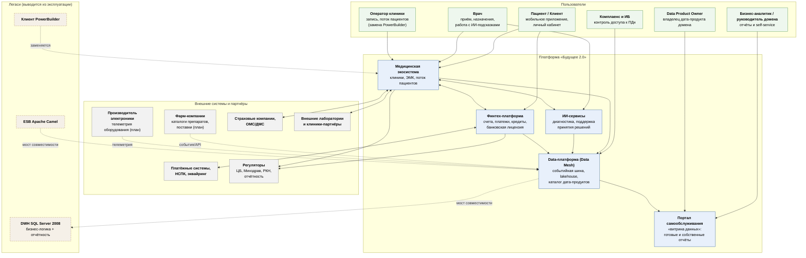

# C4. Уровень 1 — Контекст (горизонт 3 года)

## Диаграмма

## Что изменилось по сравнению с текущим состоянием

| Было (as-is) | Стало (to-be, 3 года) |
|---|---|
| DWH SQL Server — центр бизнес-логики и точка интеграции всех систем | DWH — один из источников; бизнес-логика вернулась в домены |
| Интеграции «звездой» через Camel ESB, синхронные вызовы | Событийная шина: домены публикуют события, подписчики независимы |
| Отчётность строится ИТ-подразделением по заявке | Портал самообслуживания: аналитик собирает отчёт сам в пределах своего доступа |
| Клиент PowerBuilder | Веб-интерфейс операторов, встроенный в медицинский домен |
| Новое бизнес-направление = доработка DWH | Новое направление = новый домен со своими дата-продуктами; ядро не меняется |

## Ключевое ограничение контекста

Медицинские карты, истории болезни и результаты исследований **не попадают** в
data-платформу и портал самообслуживания. Из медицинского домена в аналитический
контур публикуются только события операционного уровня (факт приёма, длительность,
загрузка ресурсов, финансовые атрибуты) — без PHI. Это не организационное соглашение,
а техническое ограничение, реализованное на уровне контрактов данных и политик
(см. [c4-container.md](c4-container.md), раздел «Контур охраны PHI»).
