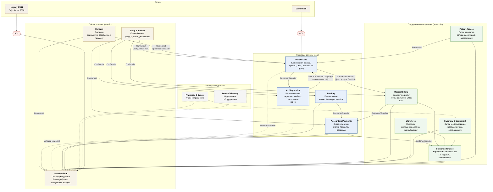

# Bounded Contexts и карта контекстов «Будущее 2.0»

## Принцип нарезки

Границы проведены по **бизнес-способностям**, а не по оргструктуре и не по таблицам DWH.
Проверочный вопрос для каждой границы: *«может ли эта команда изменить свою модель и
выпустить релиз, не согласовывая его с соседями?»* Если нет — граница проведена неверно.

Дополнительное ограничение, специфичное для «Будущего 2.0»: **клинические данные (PHI)
не пересекают границу медицинского контура**. Это влияет на нарезку — например, биллинг
медуслуг выделен в отдельный контекст именно для того, чтобы финансовые процессы могли
работать с фактом оказания услуги, не получая доступа к её клиническому содержанию.

## Карта контекстов

## Контексты: язык, ответственность, данные

| Контекст | Тип | Ответственность | Ключевые агрегаты | Что НЕ входит |
|---|---|---|---|---|
| **Patient Care** | core | ведение приёма, ЭМК, назначения, направления | `Patient`, `Encounter`, `ClinicalOrder`, `Prescription` | запись на приём, оплата, расчёт зарплаты врача |
| **Patient Access** | supporting | запись, расписание, очереди, маршрут пациента | `Appointment`, `ProviderSchedule`, `Referral` | клиническое содержание приёма |
| **AI Diagnostics** | core | инференс, версии моделей, оформление заключения | `AIStudy`, `ModelVersion` | постановка окончательного диагноза (остаётся за врачом) |
| **Medical Billing** | supporting | счёт за оказанную услугу, тарифы, обращения в страховые | `ServiceInvoice`, `InsuranceClaim`, `Tariff` | клиническое обоснование услуги |
| **Lending** | core | заявки, скоринг, кредитные договоры, графики | `LoanApplication`, `CreditAgreement`, `RepaymentSchedule` | движение денег (это Accounts & Payments) |
| **Accounts & Payments** | core | счета, проводки, переводы, эквайринг | `Account`, `Payment`, `LedgerEntry` | причина платежа (её знает домен-инициатор) |
| **Party & Identity** | generic | единый идентификатор физлица, связи, реквизиты | `Party`, `PartyLink` | роли внутри доменов (пациент/заёмщик — локальные понятия) |
| **Consent** | generic | согласия на обработку и передачу данных, отзыв | `ConsentGrant` | сами данные |
| **Workforce** | supporting | сотрудники, смены, квалификации, доступность | `Employee`, `Shift`, `Qualification` | расчёт заработной платы (внешняя система) |
| **Inventory & Equipment** | supporting | запасы, расходники, оборудование, обслуживание | `StockItem`, `Equipment`, `MaintenanceOrder` | закупочные договоры |
| **Corporate Finance** | supporting | главная книга, периоды, управленческая отчётность | `LedgerAccount`, `FinancialPeriod` | операционные расчёты доменов |
| **Data Platform** | generic | дата-продукты, контракты, доступы, каталог | `DataProduct`, `DataContract`, `AccessGrant` | доменные трансформации (их пишет домен) |
| **Pharmacy & Supply** (план) | supporting | каталог препаратов, заказы, поставки | `PharmacyOrder`, `DrugItem` | — |
| **Device Telemetry** (план) | supporting | телеметрия оборудования, состояние, предиктивное обслуживание | `DeviceReading`, `DeviceHealth` | — |

## Один термин — разные значения в разных контекстах

Это ядро подхода: одно слово естественного языка означает **разные** модели, и попытка
свести их в одну таблицу DWH — источник текущих проблем компании.

| Термин | Patient Care | Patient Access | Medical Billing | Lending | Party & Identity |
|---|---|---|---|---|---|
| **Пациент / Клиент** | субъект лечения с историей наблюдений | участник записи, у которого есть слоты и неявки | плательщик или застрахованный | заёмщик с кредитной историей и скорингом | физическое лицо с `party_id` |
| **Приём** | клинический эпизод с назначениями | забронированный слот | услуга по тарифу | — | — |
| **Отмена** | прекращение эпизода | освобождение слота | сторно счёта | расторжение договора | — |

Связь между этими понятиями — только через `party_id`, публикуемый доменом
Party & Identity. Ни один домен не хранит чужую модель целиком.

## Паттерны отношений между контекстами

| Отношение | Паттерн | Почему так |
|---|---|---|
| Patient Access ↔ Patient Care | **Partnership** | обе команды меняются вместе: изменение маршрута пациента затрагивает и запись, и приём |
| Patient Care → AI Diagnostics | **Customer/Supplier** | клиника — заказчик; ИИ-домен обязан соблюдать согласованный контракт заключения |
| AI Diagnostics → Patient Care | **OHS + Published Language** | заключение публикуется в опубликованном языке (структура, уверенность, версия модели), одинаковом для всех потребителей |
| Party & Identity → все | **Conformist** | потребители принимают `party_id` как есть; альтернатива (у каждого свой ключ) уже реализовалась в текущем DWH и стоит компании сквозной аналитики |
| Consent → Patient Care / AI / Data Platform | **Conformist** | согласие — обязательное условие обработки; интерпретировать его «по-своему» нельзя |
| Legacy DWH → Data Platform | **Anti-Corruption Layer** | модель DWH не должна протечь в новые домены; ACL умирает вместе с DWH |
| Camel ESB → Patient Care | **Anti-Corruption Layer** | то же для интеграций, которые пока живут на шине |
| Все домены → Data Platform | **Open Host Service** | домен публикует дата-продукт по единому контракту; платформа не знает доменной специфики |

## Соответствие доменов и подразделений

| Подразделение | Контексты |
|---|---|
| Клиники | Patient Care, Patient Access, Medical Billing, Inventory & Equipment |
| ИИ-компания | AI Diagnostics |
| Финтех (банк) | Lending, Accounts & Payments |
| Головной офис | Corporate Finance, Workforce, Party & Identity, Consent, Data Platform |

Границы контекстов **не совпадают** с подразделениями полностью, и это осознанно:
Party & Identity обслуживает и клиники, и банк, а Medical Billing принадлежит клиникам,
хотя работает с финансовыми понятиями. Совмещение границ контекста с оргструктурой —
типичная причина риска A6 из [карты рисков](../Task3Advanced/risk-map.md).

## Порядок выделения доменов по этапам

| Этап | Домены | Обоснование |
|---|---|---|
| **1 (0–6 мес)** — пилот | Accounts & Payments *или* Patient Access + Party & Identity | оба кандидата названы бизнесом; Party & Identity нужен в любом случае как основа сквозной аналитики |
| **2 (6–18 мес)** — критические домены | Lending, Patient Care (с ACL), Medical Billing, Consent, Corporate Finance | сюда же — антикоррупционные слои для Camel и DWH |
| **3 (18–36 мес)** — завершение | Workforce, Inventory, AI Diagnostics (полный переход), Pharmacy, Device Telemetry | отключение синхронных интеграций на критическом пути, вывод DWH |
