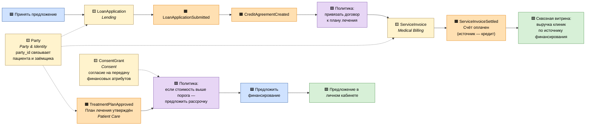
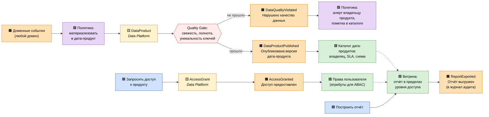

# Event Storming — целевая событийная модель

## Нотация

| Обозначение | Смысл |
|---|---|
| 🟦 **Команда** | намерение изменить состояние («Записать пациента») |
| 🟨 **Агрегат** | хранитель инвариантов, принимающий команду |
| 🟧 **Событие** | свершившийся факт в прошедшем времени («Пациент записан») |
| 🟪 **Политика** | правило «когда произошло X — сделать Y» (реакция на событие) |
| 🟩 **Read Model** | проекция для чтения: экран, витрина, отчёт |
| ⬜ **Внешняя система** | участник вне периметра компании |

Ниже — четыре среза, покрывающие ключевые сценарии компании. Полный каталог событий
с контрактами — в [events.md](events.md), описание агрегатов — в [aggregates.md](aggregates.md).

---

## Срез 1. Пациентский поток и ИИ-диагностика

```mermaid
flowchart LR
    C1["🟦 Записать<br/>пациента"] --> A1["🟨 Appointment<br/><i>Patient Access</i>"]
    A1 --> E1["🟧 AppointmentScheduled<br/>Приём назначен"]

    E1 --> P1["🟪 Политика:<br/>напомнить пациенту<br/>за 24 часа"]
    P1 --> C2["🟦 Отправить<br/>напоминание"]
    E1 --> RM1["🟩 Расписание врача<br/>Загрузка клиники"]

    C3["🟦 Начать приём"] --> A2["🟨 Encounter<br/><i>Patient Care</i>"]
    A2 --> E2["🟧 EncounterStarted<br/>Приём начат"]
    E1 -.-> C3

    C4["🟦 Назначить<br/>исследование"] --> A2
    A2 --> E3["🟧 ClinicalOrderPlaced<br/>Назначено исследование"]

    E3 --> P2["🟪 Политика:<br/>если исследование<br/>поддерживается ИИ —<br/>отправить на анализ"]
    P2 --> C5["🟦 Запросить<br/>анализ ИИ"]
    C5 --> A3["🟨 AIStudy<br/><i>AI Diagnostics</i>"]

    A3 --> G1{{"⛔ Проверка согласия<br/>ConsentGrant активен?"}}
    G1 -- нет --> E4["🟧 AIStudyRejected<br/>Анализ отклонён:<br/>нет согласия"]
    G1 -- да --> E5["🟧 AIStudyCompleted<br/>Пройдено исследование ИИ"]

    E5 --> P3["🟪 Политика:<br/>показать врачу<br/>заключение ИИ"]
    P3 --> RM2["🟩 Карточка приёма:<br/>подсказка ИИ<br/>+ уверенность модели"]
    E5 --> RM3["🟩 Метрики моделей<br/>(точность, объём, дрейф)"]

    C6["🟦 Завершить приём"] --> A2
    A2 --> E6["🟧 EncounterCompleted<br/>Приём завершён"]

    E6 --> P4["🟪 Политика:<br/>выставить счёт<br/>за оказанную услугу"]
    P4 --> C7["🟦 Выставить счёт"]
    C7 --> A4["🟨 ServiceInvoice<br/><i>Medical Billing</i>"]
    A4 --> E7["🟧 ServiceInvoiceIssued<br/>Счёт за услугу выставлен"]

    E6 --> RM4["🟩 Поток пациентов:<br/>среднее время приёма,<br/>загрузка отделений"]

    classDef cmd fill:#cfe2ff,stroke:#2c5aa0,color:#000
    classDef agg fill:#fff3cd,stroke:#a08040,color:#000
    classDef evt fill:#ffe0b2,stroke:#e07b00,color:#000
    classDef pol fill:#e7d6f5,stroke:#7b4fa8,color:#000
    classDef rm fill:#d7f0d7,stroke:#4a8f4a,color:#000
    classDef gate fill:#fdecea,stroke:#c0392b,color:#000
    class C1,C2,C3,C4,C5,C6,C7 cmd
    class A1,A2,A3,A4 agg
    class E1,E2,E3,E4,E5,E6,E7 evt
    class P1,P2,P3,P4 pol
    class RM1,RM2,RM3,RM4 rm
    class G1 gate
```

**Что здесь важно.** Событие `AIStudyCompleted` не содержит медицинского вывода в
аналитическом контуре: заключение целиком доступно только домену Patient Care (потребитель
с правом на PHI), а в data-платформу уходит проекция без клинического содержания —
факт, длительность, версия модели, уверенность. Проверка согласия (`ConsentGrant`) стоит
до вызова модели, а не после: без действующего согласия исследование не выполняется.

---

## Срез 2. Кредитный конвейер

```mermaid
flowchart LR
    C1["🟦 Подать заявку<br/>на кредит"] --> A1["🟨 LoanApplication<br/><i>Lending</i>"]
    A1 --> E1["🟧 LoanApplicationSubmitted<br/>Заявка подана"]

    E1 --> P1["🟪 Политика:<br/>запустить скоринг"]
    P1 --> C2["🟦 Оценить<br/>кредитоспособность"]
    C2 --> A1
    A1 --> E2["🟧 LoanApplicationScored<br/>Заявка оценена"]

    E2 --> D1{{"Решение"}}
    D1 -- отказ --> E3["🟧 LoanApplicationRejected<br/>Заявка отклонена"]
    D1 -- одобрение --> E4["🟧 LoanApplicationApproved<br/>Заявка одобрена"]

    E4 --> P2["🟪 Политика:<br/>сформировать договор"]
    P2 --> C3["🟦 Заключить<br/>кредитный договор"]
    C3 --> A2["🟨 CreditAgreement<br/><i>Lending</i>"]
    A2 --> E5["🟧 CreditAgreementCreated<br/>Создан кредитный договор"]

    E5 --> P3["🟪 Политика:<br/>открыть счёт<br/>и выдать средства"]
    P3 --> C4["🟦 Выдать средства"]
    C4 --> A3["🟨 Account<br/><i>Accounts &amp; Payments</i>"]
    A3 --> E6["🟧 FundsDisbursed<br/>Средства выданы"]

    E6 --> P4["🟪 Политика:<br/>активировать график<br/>платежей"]
    P4 --> A4["🟨 RepaymentSchedule<br/><i>Lending</i>"]
    A4 --> E7["🟧 RepaymentScheduleActivated<br/>График активирован"]

    E7 --> P5["🟪 Политика:<br/>ежедневно проверять<br/>просрочку"]
    P5 --> E8["🟧 RepaymentOverdue<br/>Платёж просрочен"]
    E8 --> P6["🟪 Политика:<br/>уведомить клиента,<br/>начислить пени"]

    E5 --> RM1["🟩 Портфель кредитов<br/>по продуктам и регионам"]
    E6 --> RM2["🟩 Денежный поток"]
    E8 --> RM3["🟩 Просрочка и резервы<br/>(регуляторная отчётность)"]

    EXT1["⬜ Бюро кредитных историй"] -.-> C2
    E6 -.-> EXT2["⬜ Платёжная система"]

    classDef cmd fill:#cfe2ff,stroke:#2c5aa0,color:#000
    classDef agg fill:#fff3cd,stroke:#a08040,color:#000
    classDef evt fill:#ffe0b2,stroke:#e07b00,color:#000
    classDef pol fill:#e7d6f5,stroke:#7b4fa8,color:#000
    classDef rm fill:#d7f0d7,stroke:#4a8f4a,color:#000
    classDef ext fill:#f0f0f0,stroke:#777,color:#000
    class C1,C2,C3,C4 cmd
    class A1,A2,A3,A4 agg
    class E1,E2,E3,E4,E5,E6,E7,E8 evt
    class P1,P2,P3,P4,P5,P6 pol
    class RM1,RM2,RM3 rm
    class EXT1,EXT2 ext
```

**Что здесь важно.** Домены Lending и Accounts & Payments не вызывают друг друга
синхронно: выдача средств — это реакция (политика) на событие `CreditAgreementCreated`.
Если платёжный контур временно недоступен, заявка не теряется — событие остаётся в логе
и обрабатывается после восстановления. Сценарий «выдали средства, но договор не
зафиксировался» исключён порядком публикации и идемпотентностью обработчика.

---

## Срез 3. Сквозной сценарий: медицина + финансы

Сценарий, ради которого банк и клиники объединены в одну экосистему: **рассрочка на
дорогостоящее лечение**. Он же — пример того, почему нужен единый `party_id`.

**Что здесь важно.** Событие `TreatmentPlanApproved` содержит стоимость и `party_ref`,
но не содержит диагноза и состава лечения. Финансовый домен получает ровно то, что нужно
для его решения, и не получает того, на что у него нет прав. Согласие на передачу
финансовых атрибутов проверяется политикой до формирования предложения.

---

## Срез 4. Публикация дата-продукта и работа витрины

**Что здесь важно.** Публикация дата-продукта — такое же доменное событие, как и
бизнес-факты. Витрина не «ходит в базы доменов», а работает с опубликованными версиями
продуктов; нарушение качества делает продукт видимо деградировавшим в каталоге, а не
молча искажает отчёт.

---

## Матрица «издатель → подписчик»

| Событие | Издатель | Подписчики |
|---|---|---|
| `PartyIdentified`, `PartyMerged` | Party & Identity | Patient Care, Patient Access, Lending, Accounts, Billing, Data Platform |
| `ConsentGranted`, `ConsentRevoked` | Consent | Patient Care, AI Diagnostics, Data Platform |
| `AppointmentScheduled` / `Cancelled` / `NoShowRegistered` | Patient Access | Patient Care, Workforce, Data Platform |
| `EncounterStarted` / `Completed` | Patient Care | Medical Billing, Patient Access, Data Platform |
| `ClinicalOrderPlaced` | Patient Care | AI Diagnostics, Inventory, Data Platform |
| `TreatmentPlanApproved` | Patient Care | Lending, Medical Billing, Data Platform |
| `AIStudyCompleted` / `Rejected` | AI Diagnostics | Patient Care, Data Platform (без клинического содержания) |
| `ServiceInvoiceIssued` / `Settled` | Medical Billing | Accounts & Payments, Corporate Finance, Data Platform |
| `LoanApplicationSubmitted` / `Scored` / `Approved` / `Rejected` | Lending | Accounts & Payments, Corporate Finance, Data Platform |
| `CreditAgreementCreated` | Lending | Accounts & Payments, Medical Billing, Corporate Finance, Data Platform |
| `FundsDisbursed`, `PaymentCaptured` | Accounts & Payments | Lending, Medical Billing, Corporate Finance, Data Platform |
| `RepaymentOverdue` | Lending | Accounts & Payments, Corporate Finance, Data Platform |
| `ShiftPlanned`, `EmployeeQualificationUpdated` | Workforce | Patient Access, Data Platform |
| `StockLevelLow`, `EquipmentMaintenanceDue` | Inventory & Equipment | Patient Access, Data Platform |
| `DataProductPublished`, `DataQualityViolated` | Data Platform | все домены-потребители, портал |

Ни один домен не подписан на *все* события: подписка — это явный контракт, а не право
читать чужую базу. Полные схемы — в [events.md](events.md).
