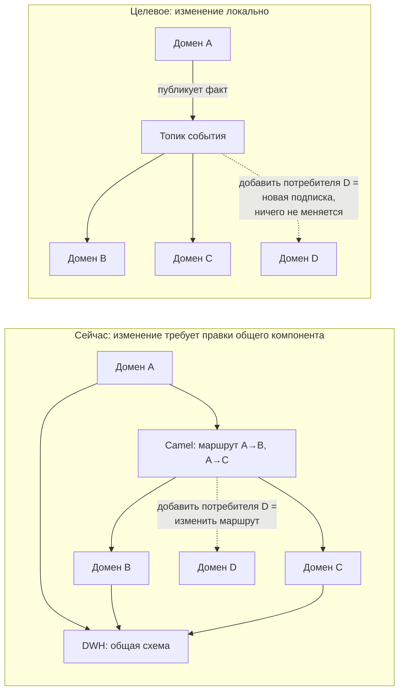

# Обоснование событийного подхода: почему события, а не Camel + DWH

## Коротко

Текущая архитектура связывает домены двумя способами: синхронными вызовами через шину
Camel и общей базой — DWH. Оба способа создают связанность, которая делает стоимость
каждого следующего изменения выше предыдущего. Событийная интеграция меняет направление
зависимости: домен-издатель не знает своих потребителей, а потребитель не зависит от
доступности издателя в момент чтения. Это единственный способ выполнить требование
бизнеса — «интеграция новых направлений без внесения значительных объёмов бизнес-логики
в DWH».

---

## 1. Что именно не работает сегодня

### 1.1. DWH как точка интеграции

Бизнес-логика живёт в хранилище, а не в доменах. Следствия, наблюдаемые в компании:

| Наблюдаемый симптом | Механика |
|---|---|
| Формирование сложных отчётов занимает часы | сотни трансформаций выполняются на каждом запросе, потому что модель универсальна и не оптимизирована ни под один сценарий |
| Медленный time-to-market | изменение бизнес-правила одного направления требует правки центральной системы, регрессионного тестирования всех отчётов и общего релизного окна |
| Невозможно развивать направления независимо | у DWH одна схема, один релизный цикл и одна команда — расписание релизов становится очередью |
| Рост числа сценариев умножает трансформации | каждый новый потребитель добавляет свою ветку логики в общее место |

Ключевая проблема не в SQL Server и не в объёме данных. Она в том, что **база данных
используется как интерфейс интеграции**. Любая схема, которую читают все, — это контракт,
который нельзя изменить, не сломав кого-то.

### 1.2. Camel как способ связывания

Шина решает задачу маршрутизации и трансформации, но не устраняет связанность:

* **Временна́я связанность.** Синхронный вызов требует доступности получателя *сейчас*.
  Недоступность ИИ-сервиса останавливает приём; недоступность банковского контура
  останавливает оформление рассрочки.
* **Связанность через логику в шине.** Знание о бизнес-правилах перетекает в маршруты
  Camel — образуется третье место, где живёт логика (домены, DWH и шина).
* **Точка-точка внутри «звезды».** Добавление потребителя требует изменения маршрута,
  то есть изменения общего компонента, а не только нового сервиса.
* **Нет истории.** Шина передаёт сообщение и забывает его. Новый потребитель не может
  восстановить состояние, ему нужна выгрузка из DWH — и круг замыкается.

---

## 2. Что даёт событийный подход

### 2.1. Инверсия зависимости

При синхронной интеграции знание о потребителях находится в издателе (или в маршрутах
шины). При событийной — потребитель сам подписывается на факт.

**Практический эффект для «Будущего 2.0»:** подключение фарм-компаний и производителя
электроники не требует изменений ни в клиниках, ни в банке, ни в DWH. Новый домен
подписывается на нужные события и публикует свои.

### 2.2. Время как измерение, а не как ограничение

Лог событий хранит историю. Из этого следует несколько практических свойств:

* новый потребитель перечитывает историю и строит своё представление — не нужна выгрузка из DWH;
* при ошибке в логике витрины она пересчитывается с нуля из событий, а не «чинится патчем» в данных;
* аналитика на потоках получается естественно: та же лента событий, которая питает
  операционные интеграции, питает и near-real-time витрины (цель третьего года).

### 2.3. Устойчивость вместо каскадных отказов

| Сценарий | Camel (синхронно) | События |
|---|---|---|
| ИИ-сервис недоступен 10 минут | приём блокируется или падает по таймауту | заявки копятся в топике, обрабатываются после восстановления; врач видит статус «ожидает» |
| Банковский контур на обслуживании | оформление рассрочки недоступно | событие `TreatmentPlanApproved` сохранено, предложение сформируется позже |
| Всплеск нагрузки в регистратуре | вызовы отваливаются по таймауту | лаг потребителя вырастает и восстанавливается; данные не теряются |
| Ошибка в обработчике | сообщение потеряно либо повторяется бесконтрольно | сообщение уходит в DLQ с причиной, обрабатывается после исправления |

Для медицинской организации это не абстракция: недоступность вспомогательного сервиса
не должна останавливать приём пациента.

### 2.4. Независимый релизный цикл

Контракт события фиксируется в Schema Registry с проверкой совместимости. Издатель
выпускает релизы, не согласовывая их с потребителями, пока схема совместима. Это прямо
влияет на скорость: сегодня релизный цикл направления определяется расписанием DWH.

### 2.5. Масштабирование по трём заявленным осям

| Ось роста (цель 3 лет) | Как отвечает событийная архитектура |
|---|---|
| **Продукты** — новые финтех- и медсервисы, монетизация ИИ | новый сервис подписывается на существующие события; события моделей (`ModelVersionPublished`, `AIStudyCompleted`) дают основу для тарификации ИИ-функций |
| **География** — 2–3 новых региона | `tenant` в конверте события; региональные контуры с локальным хранением там, где это требует регулятор, при общем формате контрактов |
| **Данные** — рост источников и переход к near-real-time | новый источник = новый издатель; batch остаётся частным случаем потока, а не отдельной архитектурой |

---

## 3. Сравнение подходов

| Критерий | Camel + DWH (as-is) | События (to-be) |
|---|---|---|
| Связанность доменов | временна́я и структурная | только контрактная |
| Где живёт бизнес-логика | домены + DWH + маршруты шины | только в доменах |
| Подключение потребителя | изменение общего компонента | новая подписка |
| Подключение нового домена | доработка DWH и маршрутов | публикация событий и дата-продуктов |
| Отказ участника | каскад | локальное отставание |
| История взаимодействий | отсутствует (есть только состояние в DWH) | лог событий с возможностью перечитывания |
| Аналитика | batch-выгрузки, часы | поток + lakehouse, минуты |
| Релизный цикл | общий | независимый |
| Аудит и расследование | по логам приложений | по ленте событий с `correlation_id` |
| Порог входа для команды | низкий | выше: нужны новые практики и компетенции |
| Отладка сценария | стек вызовов | распределённая трассировка |
| Согласованность | немедленная в рамках вызова | eventual, требует явного проектирования |

---

## 4. Честная цена решения

Событийная архитектура не бесплатна, и решение принимается с открытыми глазами.

| Плата | В чём проявляется | Чем компенсируем |
|---|---|---|
| **Eventual consistency** | отчёты разных доменов могут расходиться в моменте | SLA свежести в контракте продукта, отображение времени актуальности в витрине, автоматические сверки (риск A2) |
| **Сложность отладки** | нет единого стека вызовов | `correlation_id`/`causation_id` в каждом событии, распределённая трассировка, поиск по ленте событий |
| **Дублирование данных** | каждый домен строит своё представление | это осознанный обмен связанности на независимость; контролируется затратами на хранение (риск T4) |
| **Порядок и дубликаты** | at-least-once даёт повторы | партиционирование по ключу агрегата + идемпотентность по `event_id` |
| **Новые компетенции** | Kafka, Flink, схемы, DLQ | пилот на одном домене, обучение на реальной задаче, внешний партнёр с передачей знаний (риск O2) |
| **Эксплуатация ещё одной платформы** | кластер брокера, registry, мониторинг | управляемый сервис у облачного провайдера на старте; своя эксплуатация — только когда есть команда |

**Где событий не будет.** Синхронные вызовы остаются там, где они уместны: запрос
данных пациента внутри медицинского контура, обращение к платёжной системе, интерактивные
проверки при оформлении. Правило простое: **события — для распространения фактов между
доменами, синхронный вызов — для получения ответа внутри одного контекста**. Цель этапа 3
сформулирована точно так же: отказ от синхронных интеграций *на критическом пути*, а не
вообще.

---

## 5. Почему не альтернативы

| Альтернатива | Почему отвергнута |
|---|---|
| **Оставить DWH, оптимизировать SQL Server** | не решает главную проблему — логику в общем месте и общий релизный цикл; версия 2008 снята с поддержки; на сотнях ТБ оптимизация даёт разовый выигрыш, а не изменение динамики |
| **Мигрировать DWH в облачное хранилище «как есть»** | переносит проблему вместе с данными: те же трансформации, та же связанность, только в облаке |
| **Заменить Camel на современный API-шлюз** | лечит симптом (устаревшая шина), но сохраняет синхронную связанность и каскадные отказы |
| **Централизованное озеро данных без Data Mesh** | ответственность за качество снова у центральной команды; на 4+ направлениях команда становится узким местом — это риск A3 |
| **Полное событийное хранилище (Event Sourcing) во всех доменах** | избыточно: Event Sourcing оправдан там, где важна история изменений агрегата (счета, договоры, согласия), и лишний там, где важно текущее состояние (расписание, склад). Применяется точечно |

---

## 6. Как измерим, что подход сработал

| Метрика | Базовая линия (as-is) | Цель 12 мес | Цель 36 мес |
|---|---|---|---|
| Время формирования сложного отчёта | часы | минуты | секунды–минуты |
| Time-to-market нового отчёта | недели | дни | часы (self-service) |
| Подключение нового источника данных | месяцы | недели | дни |
| Доля синхронных вызовов на критическом пути | базовая | −50 % | 0 |
| Задержка данных в витрине | сутки (batch) | часы | минуты (near-real-time) |
| Доля отчётов, построенных пользователем самостоятельно | ≈ 0 | 40 % | 80 % |
| Инциденты из-за несовместимости контрактов | не измеряется | ≤ 2 в квартал | 0 |
| Количество бизнес-правил в DWH | базовая | −60 % | 0 (DWH выведен) |

Эти же метрики служат индикаторами рисков из
[плана управления рисками](../Task3Advanced/risk-management-plan.md): если доля
синхронных вызовов не снижается, значит, реализуется риск распределённого монолита,
и план требует пересмотра, а не продолжения.
