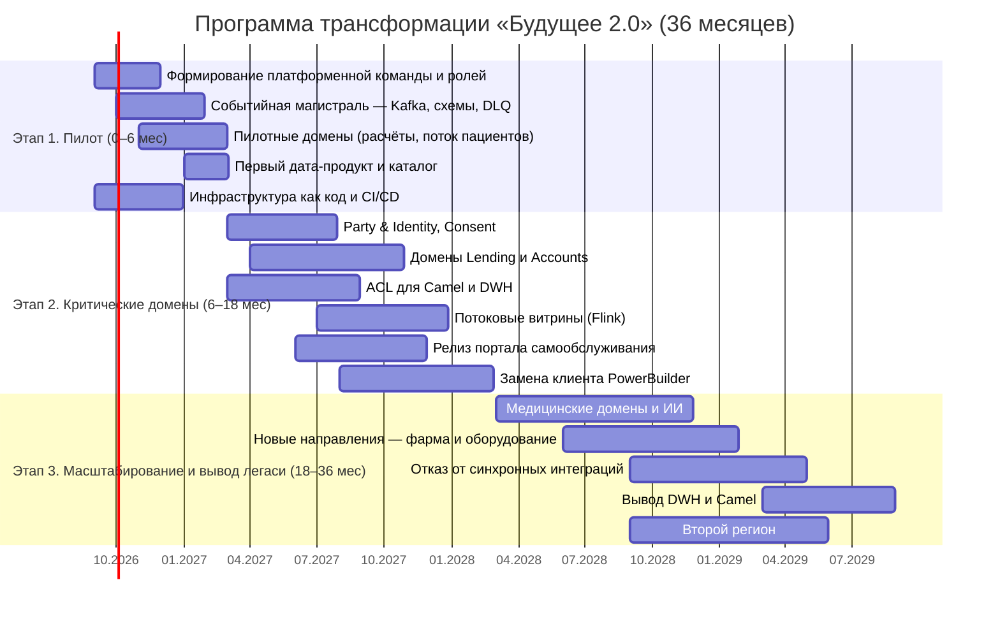
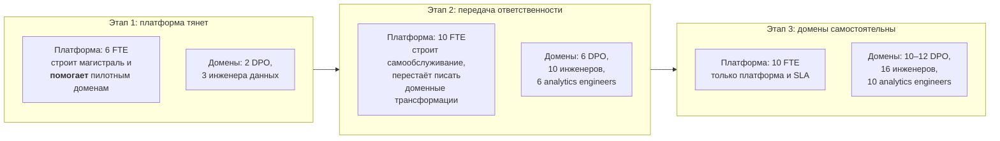

# Стратегический роадмап внедрения Data Mesh

## Общий вид

*Даты приведены от условного старта в сентябре 2026 года.*

---

## Роли

### Data Product Owner (DPO)

**Кто:** представитель бизнеса домена, не ИТ-специалист.
**Отвечает за:** состав дата-продуктов домена, их SLA, приоритеты развития, качество
данных перед потребителями.
**Полномочия:** решает, что публикуется, кому и в каком виде; согласует контракты.
**KPI:** доля потребителей, для которых соблюдён SLA; количество инцидентов качества;
время реакции на обращение потребителя; количество потребителей продукта.
**Численность:** 1 на домен → 2 (этап 1) → 6 (этап 2) → 10–12 (этап 3).

> Роль критическая: без неё Data Mesh вырождается в централизованное озеро данных
> (риск O1 из [карты рисков](../Task3Advanced/risk-map.md)).

### Data Engineer домена

**Отвечает за:** конвейеры домена — от событий до опубликованного дата-продукта,
трансформации dbt, тесты качества.
**Подчинение:** команде домена, не платформенной команде — это принципиально.
**KPI:** свежесть и полнота продуктов, время вывода нового продукта, покрытие тестами.
**Численность:** 1–2 на домен → 3 (этап 1) → 10 (этап 2) → 16 (этап 3).

### Analytics Engineer

**Отвечает за:** семантический слой домена — определения метрик и измерений, витрины
для портала. Промежуточная роль между инженером данных и аналитиком.
**KPI:** доля метрик с утверждённым определением; количество отчётов, построенных
пользователями на его моделях.
**Численность:** 2 (этап 1) → 6 (этап 2) → 10 (этап 3).

### BI-аналитик домена

**Отвечает за:** отчётность и аналитику своего направления в портале самообслуживания.
Из исполнителя заявок превращается в постановщика бизнес-вопросов.
**KPI:** доля отчётов, построенных самостоятельно (без заявки в ИТ); время от вопроса
до ответа.
**Численность:** существующие 60 человек, переобучение волнами.

### Platform Engineer (платформенная команда данных)

**Отвечает за:** событийную магистраль, lakehouse, движки запросов, каталог, CI/CD,
инфраструктуру как код.
**Ключевое ограничение:** платформа **не пишет доменные трансформации** — иначе
реализуется риск A3 (витрина превращается в новый DWH).
**KPI:** время выпуска нового дата-продукта силами домена; доступность платформы;
стоимость обработки 1 ТБ.
**Численность:** 6 (этап 1) → 10 (этапы 2–3).

### Data Steward / Governance Lead

**Отвечает за:** классификацию данных, политики доступа, соблюдение требований по ПДн и
медицинской тайне, аудит.
**KPI:** доля продуктов с заполненным классом конфиденциальности и владельцем;
результаты внутренних аудитов; ноль инцидентов PHI.
**Численность:** 1 → 2 → 3.

### Архитектор данных / Главный архитектор

**Отвечает за:** границы доменов, контракты, техрадар, ADR, фитнес-функции.
**KPI:** доля major-изменений контрактов; доля синхронных вызовов на критическом пути.
**Численность:** 1–2 на всю программу.

### CDO / Спонсор программы

**Отвечает за:** приоритеты, бюджет, назначение владельцев данных, разрешение конфликтов
между доменами, отчётность перед правлением в бизнес-метриках.

---

## Этап 1. Пилот (0–6 месяцев)

**Бизнес-цель:** «архитектурное решение согласовано, границы доменов определены,
в доменах запланированы проекты по развитию витрины данных».

| Что делаем | Результат |
|---|---|
| Формируем платформенную команду (6 FTE), назначаем первых DPO | роли существуют не на бумаге |
| Разворачиваем событийную магистраль: Kafka, реестр схем, DLQ, соглашения об именовании | единые принципы работы с событиями |
| Проводим Event Storming с бизнесом, фиксируем границы доменов и первые контракты | артефакты [Task 4](../Task4Advanced/README.md) |
| Запускаем пилот в 1–2 доменах (финансовые расчёты и/или пациентский поток) | первые события в проде |
| Строим CDC из DWH через ACL | легаси включён в событийный контур без переписывания |
| Разворачиваем среды через Terraform-модули и CI/CD | воспроизводимая инфраструктура ([Task 1](../Task1Advanced/README.md), [Task 2](../Task2Advanced/README.md)) |
| Публикуем первый дата-продукт и запускаем каталог | шаблон для остальных доменов |
| Составляем реестр бизнес-правил DWH | защита от риска O3 (потеря носителей знаний) |

**Критерии перехода к этапу 2**

* Пилотный домен публикует события в проде, подписчик работает на них.
* Первый дата-продукт опубликован с владельцем и SLA.
* Отчёт на новой витрине сходится с отчётом из DWH в пределах допуска.
* Назначены DPO во всех доменах этапа 2.
* Инфраструктура разворачивается только через CI/CD, локального состояния нет.

**Что осознанно НЕ делаем:** не трогаем медицинский домен (самый чувствительный),
не отключаем ничего в легаси, не мигрируем историю.

---

## Этап 2. Критические домены (6–18 месяцев)

**Бизнес-цель:** «реализован портал самообслуживания; бизнес-пользователи в доменах
работают с данными в новой архитектуре; допускается временное сохранение легаси».

| Что делаем | Результат |
|---|---|
| Выделяем Party & Identity и Consent | общий `party_id` — основа сквозной аналитики; управление согласиями |
| Переводим Lending и Accounts & Payments на события | кредитный конвейер работает асинхронно |
| Ставим ACL перед Camel и DWH | легаси-модели не протекают в новые домены |
| Запускаем потоковые витрины на Flink | первые near-real-time показатели |
| **Выпускаем портал самообслуживания** | каталог + семантический слой + конструктор отчётов + ABAC |
| Заменяем клиент PowerBuilder веб-интерфейсом | вывод технологии без будущего, волнами по клиникам |
| Переносим первые бизнес-правила из DWH в домены | сокращение логики в хранилище |
| Обучаем аналитиков работе с порталом | доля самостоятельных отчётов ≥ 40 % |

**Критерии перехода к этапу 3**

* Портал в проде, ≥ 40 % отчётов строятся пользователями самостоятельно.
* Не менее 5 доменов публикуют дата-продукты, ≥ 80 % моделей принадлежат доменам.
* Паритет отчётности подтверждён по контрольному набору три периода подряд.
* Доля синхронных вызовов на критическом пути снижена вдвое.
* Количество бизнес-правил в DWH сокращено на 60 %.

---

## Этап 3. Масштабирование и вывод легаси (18–36 месяцев)

**Бизнес-цель:** слабосвязанная событийная платформа; масштабирование по продуктам,
географии и данным.

| Что делаем | Результат |
|---|---|
| Переводим медицинские домены и ИИ-сервисы | завершение перехода с соблюдением контура PHI |
| Подключаем фарм-компании и производителя оборудования | проверка масштабируемости: подключение без изменения ядра |
| Отключаем синхронные интеграции на критическом пути | цель этапа выполнена |
| Разворачиваем второй регион | локализация данных, геораспределение |
| Переводим аналитику на потоки | near-real-time вместо batch |
| **Выводим DWH и Camel** | завершение strangler fig |
| Запускаем монетизацию ИИ-функций и дата-продуктов | новый источник выручки |

**Критерии завершения программы**

* DWH и Camel выведены из эксплуатации, команда поддержки легаси — не более 2 FTE.
* Синхронных интеграций на критическом пути нет.
* Новое бизнес-направление подключается за 4–8 недель.
* ≥ 80 % отчётов строятся пользователями самостоятельно.
* Показатели TCO соответствуют модели ([tco-analysis.md](tco-analysis.md)).

---

## Привязка к бизнес-целям

| Цель бизнеса | Этап | Как проверяем |
|---|---|---|
| Архитектурное решение согласовано, границы доменов определены (2 месяца) | 1 | утверждённые артефакты Task 3 и Task 4, решение архитектурного комитета |
| В доменах запланированы проекты по витрине данных | 1 | у каждого домена этапа 2 есть DPO и план дата-продуктов |
| Портал самообслуживания реализован (12 месяцев) | 2 | портал в проде, ≥ 40 % самостоятельных отчётов |
| Бизнес-пользователи работают в новой архитектуре | 2 | ≥ 5 доменов публикуют продукты, аналитики обучены |
| Временное сохранение легаси допустимо | 2 | ACL и мосты имеют владельцев и даты вывода |
| Новые продукты и монетизация ИИ (3 года) | 3 | запущены сервисы на событиях моделей |
| География: 2–3 региона | 3 | второй регион в проде, `tenant` в контрактах |
| Данные: рост источников, near-real-time | 3 | потоковые витрины в проде, batch — частный случай |
| Слабосвязанная событийная платформа | 3 | нет синхронных интеграций на критическом пути; Camel и DWH выведены |

---

## Модель роста команды и ответственности

Ключевой переход происходит на этапе 2: платформенная команда перестаёт быть
исполнителем и становится поставщиком возможностей. Если этот переход не состоится,
компания получит прежний DWH на новом стеке — и экономика из
[TCO-анализа](tco-analysis.md) не сойдётся.

## Контрольные точки для правления

| Месяц | Что показываем |
|---|---|
| 2 | утверждённая целевая архитектура, границы доменов, план проектов |
| 6 | пилот в проде, первый дата-продукт, подтверждённый паритет отчёта |
| 12 | портал самообслуживания, время формирования отчёта: часы → минуты |
| 18 | 5+ доменов на событиях, PowerBuilder заменён, −50 % синхронных вызовов |
| 24 | новое направление подключено за 4–8 недель, второй регион в работе |
| 30 | near-real-time витрины в проде, легаси-команда сокращена до 2–3 FTE |
| 36 | DWH и Camel выведены, run-rate затрат вдвое ниже сценария AS-IS |
