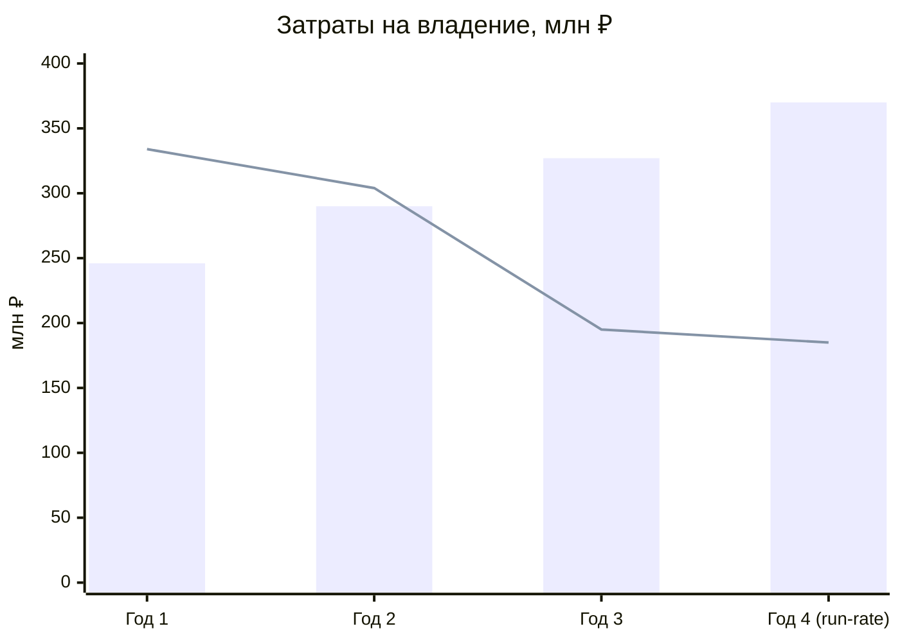

# TCO-анализ: текущая и целевая архитектура на горизонте трёх лет

Все суммы — в млн ₽, в ценах 2026 года, без НДС. Модель построена на открытых допущениях
(раздел 1) и содержит анализ чувствительности (раздел 5), потому что точность
±20 % на трёхлетнем горизонте — нормальная точность такой оценки.

## 1. Допущения

| Параметр | Значение | Комментарий |
|---|---|---|
| Объём данных | 300 ТБ на старте, +25 % в год | «сотни терабайт» из описания компании |
| Полная стоимость инженера (FTE) | 4,6 млн ₽/год | зарплата, налоги, рабочее место, ДМС |
| Полная стоимость аналитика (FTE) | 3,5 млн ₽/год | |
| Количество бизнес-аналитиков и отчётных пользователей | 60 человек | по четырём подразделениям |
| Доля времени аналитика, теряемая на ожидание и ручную сборку отчётов (as-is) | 30 % | следствие того, что сложные отчёты формируются часами |
| Инфляция затрат на персонал | 8 % в год | |
| Рост инфраструктурных затрат при сохранении легаси | 10 % в год | рост объёма данных |
| Горизонт | 3 года (36 месяцев) | совпадает с горизонтом целевой архитектуры |

Затраты на разработку самих бизнес-функций (новые медицинские и финтех-продукты)
в модель **не включены**: они возникают в обоих сценариях и не зависят от выбора
архитектуры. Сравниваются только затраты на владение данными и интеграциями.

---

## 2. Сценарий AS-IS: сохранение текущей архитектуры

| Статья затрат | Год 1 | Год 2 | Год 3 | Итого |
|---|---:|---:|---:|---:|
| Инфраструктура ЦОД (серверы, СХД, сеть, электропитание, амортизация) | 42 | 46 | 51 | 139 |
| Лицензии (SQL Server, Power BI, PowerBuilder, сопутствующее ПО) | 30 | 31 | 33 | 94 |
| Эксплуатация и поддержка (DBA, инженеры DWH, ESB, PowerBuilder — 14 FTE) | 59 | 64 | 69 | 192 |
| Разработка отчётов и доработки DWH по заявкам (8 FTE) | 34 | 37 | 40 | 111 |
| Потери времени аналитиков (60 чел. × 30 %) | 63 | 68 | 73 | 204 |
| Инциденты, простои, исправление данных | 12 | 13 | 15 | 40 |
| Комплаенс и аудит неподдерживаемых систем | 6 | 6 | 6 | 18 |
| Подключение новых бизнес-направлений в DWH (фарма, оборудование) | 0 | 25 | 40 | 65 |
| **Итого AS-IS** | **246** | **290** | **327** | **863** |

**Что скрыто за цифрами.** Рост затрат в AS-IS — не инфляционный, а структурный:
каждое новое направление добавляет трансформации в общую модель, а каждая трансформация
увеличивает и стоимость поддержки, и время формирования отчётов. Строка «подключение
новых направлений» растёт быстрее остальных именно поэтому.

**Что в таблицу не попало.** Стоимость реализации риска эксплуатации СУБД, снятой с
поддержки: инцидент безопасности в системе, где хранятся медицинские и банковские данные,
измеряется не затратами на поддержку, а регуляторными санкциями и потерей лицензии.
Этот риск в денежной оценке отсутствует, но он односторонний — он есть только в AS-IS.

---

## 3. Сценарий TO-BE: переход к событийной архитектуре и Data Mesh

Год 1 — инвестиционный: два контура работают параллельно. Год 2 — переломный.
Год 3 — легаси выводится, затраты падают.

| Статья затрат | Год 1 | Год 2 | Год 3 | Итого |
|---|---:|---:|---:|---:|
| Инфраструктура: легаси ЦОД (сокращается) | 42 | 25 | 6 | 73 |
| Инфраструктура: облако (вычисления, хранение, Kafka, Trino, Flink) | 20 | 52 | 72 | 144 |
| Лицензии и подписки: легаси | 30 | 18 | 3 | 51 |
| Лицензии и подписки: целевой стек (BI, каталог, управляемые сервисы) | 6 | 10 | 12 | 28 |
| Эксплуатация легаси (сокращающаяся команда) | 59 | 40 | 10 | 109 |
| Платформенная команда данных (6 → 10 FTE) | 28 | 46 | 46 | 120 |
| Разработка отчётов централизованной командой | 34 | 20 | 6 | 60 |
| Потери времени аналитиков | 62 | 45 | 25 | 132 |
| Миграция, внешний партнёр, обучение | 35 | 33 | 5 | 73 |
| Инциденты, простои, исправление данных | 12 | 8 | 4 | 24 |
| Комплаенс и аудит | 6 | 4 | 1 | 11 |
| Подключение новых направлений (через платформу) | 0 | 3 | 5 | 8 |
| **Итого TO-BE** | **334** | **304** | **195** | **833** |

---

## 4. Сравнение

| | Год 1 | Год 2 | Год 3 | Итого 3 года |
|---|---:|---:|---:|---:|
| AS-IS | 246 | 290 | 327 | **863** |
| TO-BE | 334 | 304 | 195 | **833** |
| **Разница** | **+88** | **+14** | **−132** | **−30** |
| Накопленная разница | +88 | +102 | −30 | |

*Столбцы — AS-IS, линия — TO-BE. Четвёртый год приведён как run-rate после вывода легаси.*

**Честный вывод по трёхлетнему горизонту: трансформация окупается ровно к его концу.**
Накопленная экономия за три года — 30 млн ₽ (3,5 %), что находится внутри погрешности
модели. Экономическое обоснование строится не на трёхлетней экономии, а на двух других
аргументах.

**Аргумент 1: run-rate четвёртого года.** После вывода легаси годовые затраты
составляют ≈ 185 млн ₽ против ≈ 370 млн ₽ в сценарии AS-IS — разница в два раза, и она
сохраняется дальше. Точка окупаемости — 33-й месяц; каждый последующий год приносит
≈ 185 млн ₽ экономии.

**Аргумент 2: возможности, недостижимые в AS-IS ни за какие деньги.**

| Возможность | AS-IS | TO-BE | Оценка эффекта |
|---|---|---|---|
| Подключение нового бизнес-направления | 6–12 месяцев доработки DWH | 4–8 недель (публикация событий и дата-продуктов) | плановые фарма и производитель оборудования: экономия ≈ 60 млн ₽ и 6 месяцев на каждом |
| Выход в новый регион | пересборка модели данных | региональный контур на готовых контрактах | цель «2–3 региона» становится выполнимой в срок |
| Near-real-time отчётность | недостижима на batch-DWH | штатный режим | новые сценарии: динамическое управление потоком пациентов, оперативный контроль просрочки |
| Монетизация ИИ-функций | нет технической основы для тарификации | события моделей = основа биллинга | новый источник выручки |
| Самостоятельная работа аналитика | заявка в ИТ | self-service | 40 % времени аналитиков возвращается в бизнес-задачи |

**Аргумент 3: риск, которого нет в TO-BE.** Продолжение эксплуатации SQL Server 2008
с медицинскими и банковскими данными — это принятие регуляторного риска, стоимость
реализации которого превышает всю программу трансформации.

---

## 5. Анализ чувствительности

Проверяем устойчивость вывода при отклонении ключевых допущений.

| Сценарий | Изменение | Итог 3 года (TO-BE) | Разница с AS-IS | Вывод |
|---|---|---:|---:|---|
| Базовый | — | 833 | −30 | окупаемость на 33-м месяце |
| Облако дороже на 30 % | +43 к инфраструктуре | 876 | +13 | окупаемость сдвигается на 4-й год, run-rate сохраняется |
| Миграция затягивается на 6 месяцев | легаси живёт дольше: +45 | 878 | +15 | тот же эффект; ключевой риск — T1 |
| Аналитики не переходят на self-service | потери времени не снижаются: +60 | 893 | +30 | **самый опасный сценарий**: экономия исчезает целиком |
| Не удалось сократить команду легаси | +35 | 868 | +5 | подтверждает: вывод легаси обязателен, «оставим на всякий случай» ломает экономику |
| Оптимистичный (быстрый вывод легаси, 2 новых направления в срок) | −55 | 778 | −85 | |

**Главный вывод анализа чувствительности:** экономика трансформации определяется не
стоимостью облака и не ценой лицензий, а **фактическим выводом легаси и фактическим
переходом аналитиков на самообслуживание**. Обе позиции — организационные, а не
технические. Это согласуется с выводом [карты рисков](../Task3Advanced/risk-map.md):
критические риски программы преимущественно организационные.

---

## 6. Структура затрат: как меняется профиль

| | AS-IS (год 3) | TO-BE (год 3) |
|---|---:|---:|
| Инфраструктура и лицензии | 26 % | 48 % |
| Люди (эксплуатация и разработка) | 33 % | 32 % |
| Потери времени аналитиков | 22 % | 13 % |
| Инциденты, комплаенс, новые направления | 19 % | 8 % |

*Доли TO-BE в сумме дают 101 % из-за округления.*

Профиль смещается от «люди чинят и обслуживают» к «платформа работает»: доля затрат,
которыми можно управлять техническими средствами (масштабирование, оптимизация запросов,
политики хранения), растёт, а доля затрат, которые растут сами по себе вместе с объёмом
данных и числом заявок, — падает. Это и есть переход от линейного роста стоимости
к управляемому.

## 7. Что нужно контролировать, чтобы модель осталась верной

| Показатель | Целевое значение | Периодичность |
|---|---|---|
| Доля выведенных легаси-компонентов | 30 % / 70 % / 100 % по годам | ежеквартально |
| Численность команды поддержки легаси | 14 → 9 → 2 FTE | ежеквартально |
| Отклонение фактических облачных расходов от плана | ≤ 10 % | ежемесячно |
| Доля отчётов, построенных пользователем самостоятельно | 40 % к 12 мес, 80 % к 36 мес | ежемесячно |
| Стоимость подключения нового источника данных | ≤ 4 недель работы одного инженера | по факту |
| Время формирования сложного отчёта | часы → минуты → секунды | ежеквартально |
